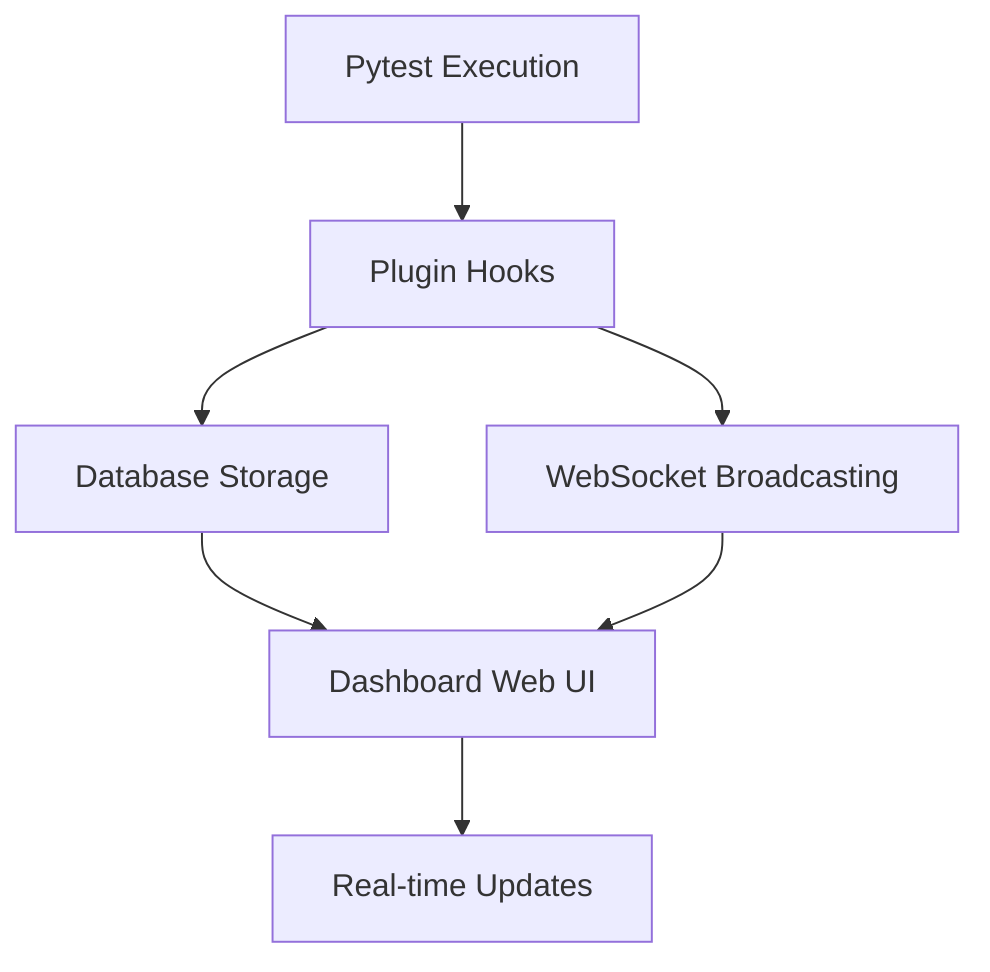

# Django-Ollama Test Dashboard Pytest Integration

This directory contains the pytest plugin integration for the django-ollama test dashboard, providing seamless test result collection and real-time monitoring capabilities.

## 🚀 Quick Start

### Installation

```bash
# Option 1: Automatic setup (recommended)
python test_dashboard/plugins/setup_cli.py --install

# Option 2: Manual setup
pip install -e .  # Install django-ollama package
python test_dashboard/plugins/setup_cli.py --verify
```

### Basic Usage

```bash
# Enable dashboard integration
pytest --dashboard

# Custom database and run name
pytest --dashboard --dashboard-db=my_tests.db --dashboard-name="Feature Tests"

# Enable real-time WebSocket updates
pytest --dashboard --dashboard-websocket

# Run specific test types with dashboard
pytest -m integration --dashboard --dashboard-name="Integration Tests"
```

## 📋 Features

### ✅ Automatic Test Collection
- **Zero Configuration**: Works out of the box with existing pytest setup
- **Test Metadata**: Captures test names, files, classes, methods, and types
- **Timing Data**: Precise setup, execution, and teardown timing
- **Error Handling**: Full error messages and stack traces
- **Coverage Integration**: Automatic pytest-cov integration

### ✅ Real-time Monitoring
- **WebSocket Broadcasting**: Live updates during test execution
- **Progress Tracking**: Real-time progress bars and status updates
- **Event Streaming**: Test start/end events, coverage updates
- **Dashboard Integration**: Updates the web dashboard in real-time

### ✅ Comprehensive Data Storage
- **SQLite Database**: Efficient local storage with full history
- **Test Results**: Individual test outcomes with detailed metadata
- **Coverage Data**: File-by-file coverage analysis
- **Environment Info**: Python version, platform, git information
- **Historical Tracking**: Compare runs over time

## 🔧 Configuration Options

### Command Line Flags

| Flag | Description | Default |
|------|-------------|---------|
| `--dashboard` | Enable dashboard integration | `False` |
| `--dashboard-db` | Database file path | `test_dashboard.db` |
| `--dashboard-name` | Custom run name | Auto-generated |
| `--dashboard-websocket` | Enable WebSocket broadcasting | `False` |
| `--dashboard-websocket-port` | WebSocket server port | `8765` |

### Pytest Markers

Add these markers to your tests for enhanced dashboard features:

```python
import pytest

@pytest.mark.dashboard_track
def test_important_feature():
    """This test will get special tracking in the dashboard."""
    assert True

@pytest.mark.dashboard_ignore
def test_internal_helper():
    """This test will run but won't clutter the dashboard."""
    assert True

@pytest.mark.integration
def test_api_endpoint():
    """Automatically detected as integration test."""
    assert True
```

### Test Type Detection

The plugin automatically detects test types based on:

- **File Paths**: `tests/integration/`, `tests/unit/`, `tests/api/`
- **Test Names**: `test_api_*`, `test_integration_*`
- **Pytest Markers**: `@pytest.mark.integration`, `@pytest.mark.unit`

## 🏗️ Architecture

### Plugin Structure

```
test_dashboard/plugins/
├── __init__.py                 # Package initialization
├── pytest_dashboard.py        # Main pytest plugin
├── realtime.py                # WebSocket broadcasting
├── conftest.py                 # Pytest configuration
├── plugin_setup.py             # Installation utilities
├── setup_cli.py                # Command-line setup tool
├── test_integration.py         # Integration tests
└── requirements.txt            # Optional dependencies
```

### Data Flow



### Hook Integration

The plugin integrates with these pytest hooks:

- `pytest_sessionstart`: Create test run record
- `pytest_runtest_setup`: Record test start
- `pytest_runtest_call`: Track test execution
- `pytest_runtest_teardown`: Cleanup timing
- `pytest_runtest_logreport`: Process test results
- `pytest_sessionfinish`: Finalize run and cleanup

## 📊 Database Schema

### Test Runs Table
```sql
CREATE TABLE test_runs (
    id INTEGER PRIMARY KEY,
    run_id TEXT UNIQUE,
    started_at TIMESTAMP,
    finished_at TIMESTAMP,
    status TEXT,
    total_tests INTEGER,
    passed_tests INTEGER,
    failed_tests INTEGER,
    duration_seconds REAL,
    test_command TEXT,
    git_commit TEXT,
    git_branch TEXT
);
```

### Test Results Table
```sql
CREATE TABLE test_results (
    id INTEGER PRIMARY KEY,
    run_id INTEGER REFERENCES test_runs(id),
    test_name TEXT,
    test_file TEXT,
    test_type TEXT,
    status TEXT,
    duration_seconds REAL,
    error_message TEXT,
    started_at TIMESTAMP
);
```

## 🔄 WebSocket Events

When `--dashboard-websocket` is enabled, the plugin broadcasts these events:

### Test Run Events
```json
{
  "type": "test_run_start",
  "run_id": "uuid-string",
  "test_command": "pytest --dashboard",
  "total_tests": 42,
  "timestamp": "2024-01-01T12:00:00Z"
}
```

### Individual Test Events
```json
{
  "type": "test_end",
  "run_id": "uuid-string",
  "test_name": "test_example",
  "status": "PASSED",
  "duration": 0.123,
  "timestamp": "2024-01-01T12:00:01Z"
}
```

### Coverage Updates
```json
{
  "type": "coverage_update",
  "run_id": "uuid-string",
  "file_path": "src/example.py",
  "coverage_percent": 85.5,
  "timestamp": "2024-01-01T12:00:02Z"
}
```

## 🧪 Testing the Integration

### Run Integration Tests
```bash
# Test the plugin functionality
python test_dashboard/plugins/setup_cli.py --test

# Manual integration test
pytest test_dashboard/plugins/test_integration.py -v

# Test with actual dashboard integration
pytest --dashboard tests/ --dashboard-name="Integration Test"
```

### Create Demo Data
```bash
# Generate example tests and run them
python test_dashboard/plugins/setup_cli.py --examples
pytest --dashboard test_dashboard_examples/ --dashboard-name="Demo Tests"
```

## 🔧 Troubleshooting

### Common Issues

**Plugin not loading:**
```bash
# Verify installation
python test_dashboard/plugins/setup_cli.py --verify

# Check pytest plugin registration
pytest --version
pytest --help | grep dashboard
```

**Database errors:**
```bash
# Check database permissions
ls -la test_dashboard.db

# Reset database
rm test_dashboard.db
pytest --dashboard tests/ --dashboard-name="Fresh Start"
```

**WebSocket connection issues:**
```bash
# Check port availability
netstat -ln | grep 8765

# Use different port
pytest --dashboard --dashboard-websocket --dashboard-websocket-port=8766
```

### Debug Mode

Enable verbose logging for troubleshooting:

```bash
export PYTHONPATH="$(pwd)/test_dashboard:$PYTHONPATH"
pytest --dashboard --dashboard-websocket -v -s tests/
```

## 🎯 Best Practices

### Optimal Usage Patterns

1. **Development Workflow**:
   ```bash
   # Regular development testing
   pytest --dashboard --dashboard-name="Dev Tests"

   # Feature development with live updates
   pytest --dashboard --dashboard-websocket tests/features/
   ```

2. **CI/CD Integration**:
   ```bash
   # CI pipeline with persistent database
   pytest --dashboard --dashboard-db="ci_tests_${BUILD_ID}.db"
   ```

3. **Performance Testing**:
   ```bash
   # Track performance regressions
   pytest -m slow --dashboard --dashboard-name="Performance Suite"
   ```

### Configuration Tips

- Use meaningful run names for easier identification
- Enable WebSocket only during active development
- Set up different databases for different test suites
- Use markers to organize tests in the dashboard

## 🔮 Advanced Features

### Custom Test Markers
```python
# Add custom markers in conftest.py
def pytest_configure(config):
    config.addinivalue_line(
        "markers",
        "critical: mark test as critical for dashboard highlighting"
    )
```

### Environment-specific Configuration
```python
# conftest.py
import os

def pytest_addoption(parser):
    if os.getenv('CI'):
        # Automatically enable dashboard in CI
        parser.set_defaults(dashboard=True)
```

### Coverage Analysis Integration
```python
# Automatic coverage reporting
pytest --dashboard --cov=src --cov-report=html
```

## 📚 API Reference

### Plugin Class Methods

```python
from test_dashboard.plugins.pytest_dashboard import DashboardTestPlugin

plugin = DashboardTestPlugin()

# Core methods
plugin.pytest_configure(config)      # Setup plugin
plugin.pytest_sessionstart(session)  # Start test run
plugin.pytest_runtest_logreport(report)  # Process results

# Utility methods
plugin._extract_test_info(item)      # Get test metadata
plugin._collect_environment_info()    # System information
plugin._get_git_info()               # Git repository data
```

### WebSocket Broadcasting

```python
from test_dashboard.plugins.realtime import RealTimeBroadcaster

broadcaster = RealTimeBroadcaster(port=8765)
broadcaster.start_server()

# Broadcast events
broadcaster.broadcast_test_start(run_id, test_name, test_file)
broadcaster.broadcast_test_end(run_id, test_name, status, duration)
```

---

## 🤝 Contributing

1. Fork the repository
2. Create a feature branch
3. Add tests for new functionality
4. Run the integration test suite
5. Submit a pull request

## 📄 License

This plugin is part of the django-ollama project and follows the same licensing terms.